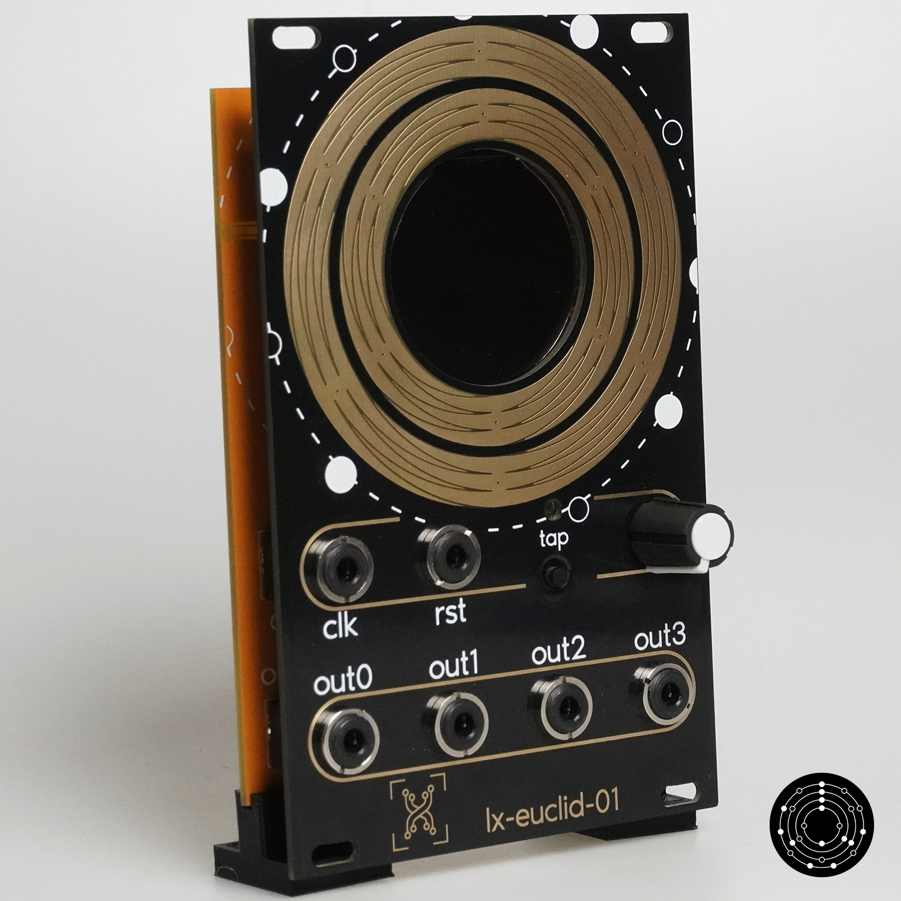

# lx-euclid-001 alpha version

**The alpha version support only release up to version [0.0.4](https://github.com/lucblender/lx-euclid-001/releases/tag/v0.0.4)!**



# Installation of code and updates

## Install an update from an original module

Download the last UF2 image in the [releases](https://github.com/lucblender/lx-euclid-001/releases/)

Remove the module from your eurorack system, carefully plug the USB-C cable on the screen and plug it to your computer while carefully pressing the boot button on the screen. *Put a gentle pressure on the screen when pressing the boot button, the screen is fragile!*

When connected to your computer, a drive should open (like an usb-stick) and you can drag and drop the downloaded UF2 file. After this action, the module will reboot with the new software

## Install micropython and the python source

**This chapter is for advanced programmer only that want to play with the current indev code or want to create custom micropython firmware.**
Download the last micropython image for the rp2040 on the [official raspberry pi website](https://www.raspberrypi.com/documentation/microcontrollers/micropython.html).

Remove the module from your eurorack system, carefully plug the USB-C cable on the screen and plug it to your computer while carefully pressing the boot button on the screen. *Put a gentle pressure on the screen when pressing the boot button, the screen is fragile!*

When connected to your computer, a drive should open (like an usb-stick) and you can drag and drop the official micropython UF2 image file. After this action, the module will reboot with the new software.

When rebooted, your module has micropython installed. You can now drop all the files on the rp2040 with your favourite IDE  (Thonny, Visual Studio Code, ...).

You can either install all the \*.py files from the root directory or all the bytecode files from the [binaries](binaries/) directory.

**Warning: having all the files in \*.py won't work because of the RAM size, it's necessary. Put only the files you  will want to edit in \*.py extension and the files you won't edit in \*.mpy extension**

You will also need all the \*.bin files (pictures files) installed at the root of your rp2040:

- [helixbyte_r5g6b5.bin](binaries/helixbyte_r5g6b5.bin)
- [parameter_selected.bin](binaries/parameter_selected.bin)
- [parameter_unselected.bin](binaries/parameter_unselected.bin)

## Build micropython custom uf2

Taken from [Raspberry Pi Pico Python SDK pdf book](https://datasheets.raspberrypi.com/pico/raspberry-pi-pico-python-sdk.pdf).

Install micropython and submodules p5:

``` shell
git clone https://github.com/micropython/micropython.git --branch master
cd micropython
make -C ports/rp2 submodules

```

From there, you'll need to execute shells scripts from ```shell scripts```directory.
Open copy-python-files.sh , change source_directory on line 4 and destination_directory line 7.
And open build-uf2.sh and change output uf2 destination file on line 5.

When done you can execute the two scripts. First will copy python files into micropython git folders and second will build an uf2 image of micropython containing our files and copy it to our destination:

``` shell
./copy-python-files.sh
./build-uf2.sh
```

## Completely  reset a module

If you made the module by yourself or have any software problem, you may need to reset the whole module. Download the [flash_nuke.uf2](https://cdn-learn.adafruit.com/assets/assets/000/099/419/original/flash_nuke.uf2?1613329170) image. This image will completely delete all data from the flash of the processor.

Remove the module from your eurorack system, carefully plug the USB-C cable on the screen and plug it to your computer while carefully pressing the boot button on the screen. *Put a gentle pressure on the screen when pressing the boot button, the screen is fragile!*

When connected to your computer, a drive should open (like an usb-stick) and you can drag and drop the *flash_nuke.uf2* file.

Your module is now ready for a new installation.

You can either do the micropython installation as described in the [Install micropython and the python source](#install-micropython-and-the-python-source)
or the [Install an update from a original module](#install-an-update-from-an-original-module).

For the latter you will need to do an extra step since some files are prepackaged in the flash when the device is produced, and we started the procedure by "nuking" the whole flash, so we removed those precious files.

You will need to connect your module with an USB-C cable to your computer and add the following file with the software of your choice (Thonny, Visual Studio Code, ...):

- [helixbyte_r5g6b5.bin](binaries/helixbyte_r5g6b5.bin)
- [parameter_selected.bin](binaries/parameter_selected.bin)
- [parameter_unselected.bin](binaries/parameter_unselected.bin)
